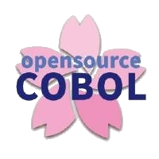

# COBOL 4J [↩](./README.md#top)

<table style="font-family:Helvetica,Arial;line-height:1.6;">
  <tr>
  <td style="border:0;padding:0 4px 0 0;min-width:100px;"></td>
  <td style="border:0;padding:0;vertical-align:text-top;">This page presents usage information about <a href="https://github.com/opensourcecobol/opensourcecobol4j">COBOL 4J</a> on a Windows machine.</td>
  </tr>
</table>

## COBOL 4J Environment

The execution of the [COBOL 4J][cobol_4j] compiler depends on the two environment variables [1](#footnote_01) :
- `PATH` contains the path to executable `java.exe`.
- `CLASSPATH` contains the path to library `libcobj.jar` [2](#footnote_02).

<!--
%JAVA_HOME%\bin\jar tf %COBJ_HOME%\lib\opensourcecobol4j\libcobj.jar|awk '/\/$/{if ($0 !~ /^META/){s=$0;gsub(/\//,"",s);if (length($0)==length(s)+3){print $0}}}
-->

<!--=======================================================================-->

## Footnotes [**&#x25B4;**](#top)

[1] ***Environment variables*** [↩](#anchor_01)

<dl><dd>
For instance we invoke the <a href="https://github.com/opensourcecobol/opensourcecobol4j" rel="external">COBOL 4J</a> compiler as follows in our batch files :
<pre style="font-size:80%;">
[...]
<a href="https://learn.microsoft.com/en-us/windows-server/administration/windows-commands/set_1"><b>set</b></a> "__PATH=%PATH%"
<b>set</b> "PATH=%PATH%;%JAVA_HOME%\bin"
<b>set</b> "__CLASSPATH=%CLASSPATH%"
<b>if defined</b> CLASSPATH ( <b>set</b> "CLASSPATH=%CLASSPATH%;%COBJ_HOME%\lib\opensourcecobol4j\libcobj.jar"
) <b>else</b> ( <b>set</b> "CLASSPATH=%COBJ_HOME%\lib\opensourcecobol4j\libcobj.jar"
)
<a href="https://learn.microsoft.com/en-us/windows-server/administration/windows-commands/call"><b>call</b></a> "%_COBJ_CMD%" %__COBJ_OPTS% %__SOURCE_FILES:\=/%
<b>set</b> "PATH=%__PATH%"
<b>set</b> "CLASSPATH=%__CLASSPATH%"
[...]
</pre>
where the defined variables :
<ul>
<li><code>JAVA_HOME</code> equals <code>C:\opt\jdk-temurin-17.0.11_9</code> (for `java.exe` command).</li>
<li><code>COBJ_HOME</code> equals <code>C:\opt\cobj</code> (our <a href="https://github.com/opensourcecobol/opensourcecobol4j">COBOL 4J</a> installation directory).</li>
<li><code>_COBJ_CMD</code> equals <code>%COBJ_HOME%\bin\cobj.exe</code>.</li>
</ul>
<blockquote>
🔎 We distinguish two kinds of variabls in our batch files :
<ul>
<li>Variables starting with a letter are defined either in <a href="./setenv.bat"><code>setenv.bat</code></a> (eg. <code>COBJ_HOME</code>) or by the Windows environment (eg. <code>PATH</code>).</li>
<li>Variables starting with one (or more) <code>_</code> character(s) are always local to the build file where they appear.</li>
</ul>
</blockquote>
</dd></dl>

[2] **`libcobj.jar` *dependencies*** [↩](#anchor_02)

<dl><dd>
Version <b>1.1.1</b> of library <code>libcobj.jar</code> has the following dependencies (see also Gradle build file <a href="https://github.com/opensourcecobol/opensourcecobol4j/blob/develop/libcobj/app/build.gradle.kts#L29"><code>build.gradle.kts</code></a>) :

| Project | MVN&nbsp;repository | Version |
|:--------|:--------------------|:--------|
| [Guava](https://github.com/google/guava#guava-google-core-libraries-for-java) | [com.google.common](https://mvnrepository.com/artifact/com.google.guava/guava) | [33.2.1-jre](https://mvnrepository.com/artifact/com.google.guava/guava/33.2.1-jre) |
| [Guava](https://github.com/google/guava#guava-google-core-libraries-for-java) | [com.google.thirdparty](https://mvnrepository.com/artifact/com.google.guava/guava) | [33.2.1-jre](https://mvnrepository.com/artifact/com.google.guava/guava/33.2.1-jre) |
| [SQLite JDBC](https://github.com/xerial/sqlite-jdbc#sqlite-jdbc-driver) | [org.sqlite](https://mvnrepository.com/artifact/org.xerial/sqlite-jdbc) | [3.46.0.0](https://mvnrepository.com/artifact/org.xerial/sqlite-jdbc/3.46.0.0) |
| [Apache Commons CLI](https://commons.apache.org/proper/commons-cli/) | [commons-cli](https://mvnrepository.com/artifact/commons-cli/commons-cli) | [1.8.0](https://mvnrepository.com/artifact/commons-cli/commons-cli/1.8.0) |
| [Check Framework](https://checkerframework.org/) | [org.checkerframework](https://mvnrepository.com/artifact/org.checkerframework/checker-qual) <b>a)</b> | [3.42.0](https://mvnrepository.com/artifact/org.checkerframework/checker-qual/3.42.0) |
| [J2ObjC Annotations](https://mvnrepository.com/artifact/com.google.j2objc/j2objc-annotations) | [j2objc-annotations](https://mvnrepository.com/artifact/com.google.j2objc/j2objc-annotations) <b>a)</b> | [3.0.0](https://mvnrepository.com/artifact/com.google.j2objc/j2objc-annotations/3.0.0) |
| [Error Prone Annotations](https://github.com/google/error-prone#error-prone) | [com.google.errorprone](https://mvnrepository.com/artifact/com.google.errorprone/error_prone_annotations) <b>a)</b> | [2.26.1](https://mvnrepository.com/artifact/com.google.errorprone/error_prone_annotations/2.26.1) |

<b>a)</b> Compile depenpency of <a href="https://github.com/google/guava#guava-google-core-libraries-for-java" rel="external">Guava</a>.

</dd></dl>

***

*[mics](https://lampwww.epfl.ch/~michelou/)/July 2024* [**&#9650;**](#top)
&nbsp;

<!-- link refs -->
[cobol_4j]: https://github.com/opensourcecobol/opensourcecobol4j
