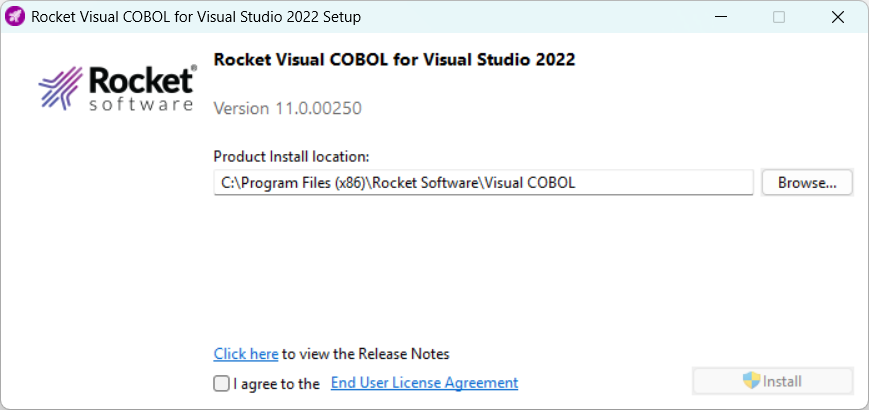

# Visual COBOL 11 [↩](./README.md#top)

<table style="font-family:Helvetica,Arial;line-height:1.6;">
  <tr>
  <td style="border:0;padding:0 4px 0 0;min-width:100px;"></td>
  <td style="border:0;padding:0;vertical-align:text-top;">This page presents usage information about <a href="https://www.rocketsoftware.com/en-us/products/cobol/visual-cobol">Visual COBOL</a> from Rocket Software on a Windows machine.</td>
  </tr>
</table>

## Installation

## Environment Setup

Setting up the [Visual COBOL][visual_cobol] environment :

<pre style="font-size:80%;">
<b>&gt; <a href="https://learn.microsoft.com/en-us/windows-server/administration/windows-commands/echo" rel="external">echo</a> %COBDIR%</b>
C:\Program Files (x86)\Rocket Software\Visual COBOL
&nbsp;
<b>&gt; "%COBDIR%\bin64\cblpromp.exe</b>
@SET COBDIR=C:\Program Files (x86)\Rocket Software\Visual COBOL\;%COBDIR%
@SET PATH=C:\Program Files (x86)\Rocket Software\Visual COBOL\bin64\;C:\Program Files (x86)\Rocket Software\Visual COBOL\binn64\;C:\Program Files (x86)\Rocket Software\Visual COBOL\bin\;C:\Program Files (x86)\Rocket Software\Visual COBOL\AdoptOpenJDK\bin;%PATH%
@SET LIB=C:\Program Files (x86)\Rocket Software\Visual COBOL\lib64\;%LIB%
@SET COBCPY=%COBCPY%;C:\Program Files (x86)\Rocket Software\Visual COBOL\cpylib\;C:\Program Files (x86)\Rocket Software\Visual COBOL\cpylib\basecl
@SET MFTRACE_ANNOTATIONS=C:\Program Files (x86)\Rocket Software\Visual COBOL\etc\mftrace\annotations
@SET MFTRACE_LOGS=C:\ProgramData\Micro Focus\Visual COBOL\11.0\mftrace\logs
@SET INCLUDE=C:\Program Files (x86)\Rocket Software\Visual COBOL\include;%INCLUDE%
@SET JAVA_HOME=C:\Program Files (x86)\Rocket Software\Visual COBOL\AdoptOpenJDK
@SET CLASSPATH=C:\Program Files (x86)\Rocket Software\Visual COBOL\bin\mfcobol.jar;C:\Program Files (x86)\Rocket Software\Visual COBOL\bin\mfcobolrts.jar;C:\Program Files (x86)\Rocket Software\Visual COBOL\bin\mfsqljvm.jar;C:\Program Files (x86)\Rocket Software\Visual COBOL\bin\mfunit.jar;C:\Program Files (x86)\Rocket Software\Visual COBOL\bin\mfidmr.jar;C:\Program Files (x86)\Rocket Software\Visual COBOL\bin64\mfle370.jar;%CLASSPATH%
@SET MFDBFH_SCRIPT_DIR=C:\Program Files (x86)\Rocket Software\Visual COBOL\etc\mfdbfh\scripts
@SET TXDIR=C:\Program Files (x86)\Rocket Software\Visual COBOL\
@SET Path=C:\Program Files (x86)\Rocket Software\Visual COBOL\Microsoft\VC\Tools\MSVC\14.40.33807\bin\Hostx64\x64;C:\Program Files (x86)\Rocket Software\Visual COBOL\Microsoft\SDK\10\Bin\10.0.19041.0\x64;%PATH%
@SET LIB=C:\Program Files (x86)\Rocket Software\Visual COBOL\Microsoft\VC\Tools\MSVC\14.40.33807\lib\x64;C:\Program Files (x86)\Rocket Software\Visual COBOL\Microsoft\SDK\10\Lib\10.0.19041.0\um\x64;C:\Program Files (x86)\Rocket Software\Visual COBOL\Microsoft\SDK\10\Lib\10.0.19041.0\ucrt\x64;%LIB%
@SET COBREG_64_PARSED=True
</pre>

<pre style="font-size:80%;">
<b>&gt; "%COBDIR%\AdoptOpenJDK\bin\java.exe" -version</b>
openjdk version "21.0.7" 2025-04-15 LTS
OpenJDK Runtime Environment Temurin-21.0.7+6 (build 21.0.7+6-LTS)
OpenJDK 64-Bit Server VM Temurin-21.0.7+6 (build 21.0.7+6-LTS, mixed mode, sharing)
</pre>

<pre style="font-size:80%;">
<b>&gt; "%COBDIR%\bin64\cblms.exe"</b>
Rocket (R) COBOL - Configuration Utility for the Microsoft Build Tools & SDK
11.0.0.84 (C) 1984-2025 Rocket Software, Inc. or its affiliates.

options:

-U              Update to all latest versions installed in default folders
-U
           Update to latest version installed in default folder
-U
:<version> Update to version installed in default folder
-U
:<path>    Update to latest version installed in given folder
-U
:<path>?<version> Update to version installed in given folder
-L              List all versions installed in default folder
-L
           List versions installed in default folders
-L
:<path>    List versions installed in given folder
-Q              Display current selected versions
-Q
           Display current selected version
-R              Clear all version information
-F:<file>       Redirect all output to given file
-64             Update for 64-bit only
-H              Display usage help

For each command:
        
       is S or SDK for Windows SDK
                     B or BT  for Microsoft Build Tools
        <version> is n.n.n.n for Windows SDK
                     n.n.n   for Build Tools
                     n       for list Id
</pre>

Lists all versions of the Microsoft Build Tools and SDK packages that are located in the
default folders.

<pre style="font-size:80%;">
<b>&gt; "%COBDIR%\bin64\cblms.exe" -L</b>
Rocket (R) COBOL - Configuration Utility for the Microsoft Build Tools & SDK
11.0.0.84 (C) 1984-2025 Rocket Software, Inc. or its affiliates.

Windows SDK

Id  Version       Location

0] 10.0.19041.0  c:\Program Files (x86)\Windows Kits\10
1] 10.0.22000.0  c:\Program Files (x86)\Windows Kits\10

Microsoft Build Tools

Id  Version       Location

0] 14.44.35207 c:\Program Files\Microsoft Visual Studio\2022\Community
1] 14.29.30133 c:\Program Files (x86)\Microsoft Visual Studio\2019\Community
</pre>

Displays the versions currently in use by the [Visual COBOL][visual_cobol] environment.

<pre style="font-size:80%;">
<b>&gt; "%COBDIR%\bin64\cblms.exe" -Q</b>
Rocket (R) COBOL - Configuration Utility for the Microsoft Build Tools & SDK
11.0.0.84 (C) 1984-2025 Rocket Software, Inc. or its affiliates.

Windows SDK
 location = C:\Program Files (x86)\Rocket Software\Visual COBOL\Microsoft\SDK\10
 version  = 10.0.19041.0

Microsoft Build Tools
 location = C:\Program Files (x86)\Rocket Software\Visual COBOL\Microsoft
 version  = 14.40.33807
</pre>

<!--=======================================================================-->

## Footnotes [**&#x25B4;**](#top)

<!-- [1](#footnote_01) -->
<!--
[1] ***`cbllink` options*** (Mcro Focus) [↩](#anchor_01)

<dl><dd>
</dd></dl>
-->

***

*[mics](https://lampwww.epfl.ch/~michelou/)/November 2025* [**&#9650;**](#top)
&nbsp;

<!-- link refs -->
[visual_cobol]: https://www.microfocus.com/en-us/products/visual-cobol/overview
