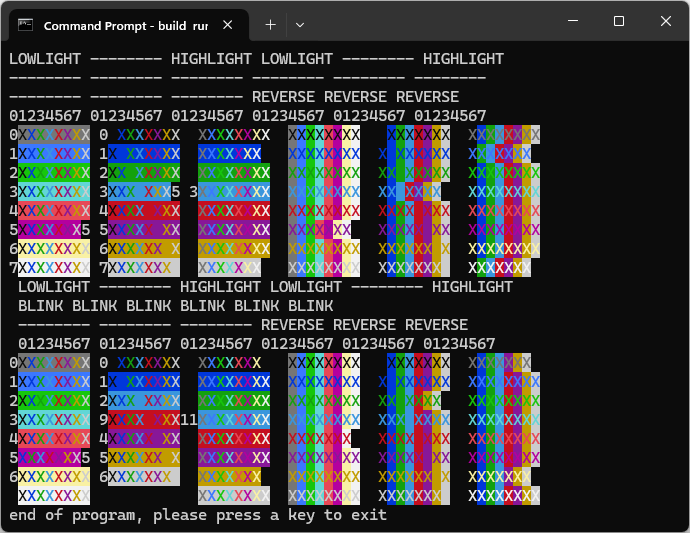

# COBOL examples from John Dovey <a href="../README.md">⬆</a>

<table style="font-family:Helvetica;line-height:1.6;">
  <tr>
  <td style="border:0;padding:0 10px 0 0;min-width:100px;">
    
  </td>
  <td style="border:0;padding:0;vertical-align:text-top;">
    Directory <strong><code>dovey-examples\</code></strong> contains <a href="" rel="external" title="COBOL">COBOL</a> code examples coming from John Dovey's GitHub repository <a href="https://github.com/JohnDovey/GNUCobol-Samples">GNUCobol-Samples</a>.
  </td>
  </tr>
</table>

## `Colors` Example

Example `Colors` has the following directory structure :

<pre style="font-size:80%;">
<b>&gt; <a href="https://learn.microsoft.com/en-us/windows-server/administration/windows-commands/tree">tree</a> /a /f . | <a href="https://learn.microsoft.com/en-us/windows-server/administration/windows-commands/findstr">findstr</a> /v /b [A-Z]</b>
|   <a href="./Colors/build.bat">build.bat</a>
|   <a href="./Colors/build.sh">build.sh</a>
\---src
    \---main
        \---cobol
                <a href="./Colors/src/main/cobol/Colors.cbl">Colors.cbl</a>
</pre>

Command [`build -verbose clean run`](./Colors/build.bat) generates and executes the [COBOL] program `target\Colors.exe` :

<pre style="font-size:80%;">
<b>&gt; <a href="./Colors/build.bat">build</a> -verbose clean run</b>
Compile 1 COBOL source file into directory "target"
Execute program "target\Colors.exe"
</pre>

***

*[mics](https://lampwww.epfl.ch/~michelou/)/April 2024* [**&#9650;**](#top)
&nbsp;

<!-- link refs -->

[cobol]: https://
